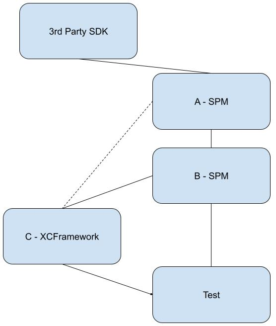

# xcode_spm_xcframework
This repo show case an interesting issue with xcode when using SPM and XCFramework combined with implict imports cause an duplicated library


## Use case

We have the following use case, a Simple project

- One XCFramework `C`, which hosts the class `C`
- One SPM Module, hosting two libraries `A` and `B`, each one defining corresponding class
- One testing app


The dependency graph between the different package is defined in the following figure:

<!-- <p align="left"> 
  
</p> -->
 <!--  556 × 656 --> 


* `B` depends on `A` i.e (B->A).
* `C` depends (directly) on `B` i.e (C->B).
* `C` depends (directly) on `A` i.e (C->A).
* The `Test` app depends on all modules `B` and `C`.

In this repo we have several branches that research different scenarios and build configuration to understand how it is best to ship applications with similar modules mix and hierarchy.

### Branch - main

On the `main` branch we have the default setup, where we started our journy.
We configured the targets linking and embeddig explictly. i.e:

* We link the app against `B`, and `C`
* The app is depending on C as a target dependency
* We embed the `C` framework with the app as well

* `A` and `B` schemes are auto generated by SPM and configured automatically
* The `C` is linked against `A` and `B`

Run the app and see the issue:
1. You will notice a runtime warning saying something like
   ```
   objc[22073]: Class _TtC1A1A is implemented in both /Users/danielbac/Library/Developer/Xcode/DerivedData/Test-fsbacwqhuuawxihdgrijvveuzspv/Build/Products/Debug-iphonesimulator/C.framework/C (0x10498c290) and /Users/danielbac/Library/Developer/Xcode/DerivedData/Test-fsbacwqhuuawxihdgrijvveuzspv/Build/Products/Debug-iphonesimulator/PackageFrameworks/B_3C9_PackageProduct.framework/B_3C9_PackageProduct (0x104968298). One of the two will be used. Which one is undefined.
   ```
2. You will also notice the application main screen, You will see a grid with 3 rows:
   The first row present the memory address of a static variable that is defined in the `A` module. This static variable is a static property on an `A` extension that initialize a static instance of the class `A`
   The second row present the memory address of the same static variable just accessed through class `C`.
   Note that the address is different on between the first and second line. This is due to the warning we see on the console
   I'm not 100% why is that hapening.
3. 

### Solution

We found several solution for this problem
1. checkout branch `remove-excplict-a-linking`.
   In this branch we have removed the expplicit linking of the `A` module from both the `C` XCFramework and the main app `Test` target
   This result in removal of the warning and fix of our static var being init twice issue.
   Never the less this solution is far from idle is we implict import module `A` into the application and into the `C` XCFramework.
2. checkout branch `remove-excplict-a-linking-from-c-only` 
   In this branch we explictly linking the `A` module to both the `C` XCFramework and the main `Test` app.
   This also results in a solution to our problem and personaly I think its better as it explictly linking all the relvant frameworks
3. checkout branch `implict-linking-c-only`
   In this branch we removed `A` and `B` modules linking from the main app `Test` and linked only against `C`
   `C` can be linked against both `A` and `B` or only `B` (in this branch we only link `C` against `B`).
   
